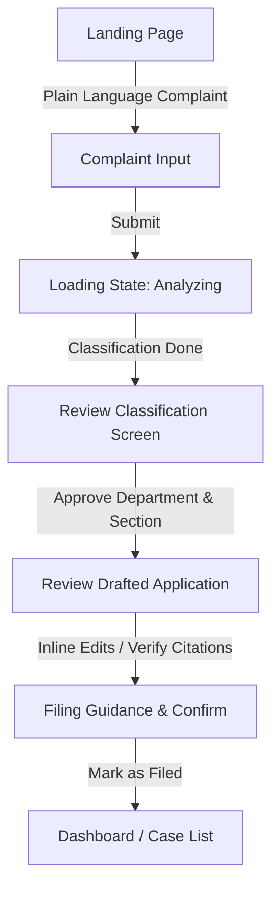
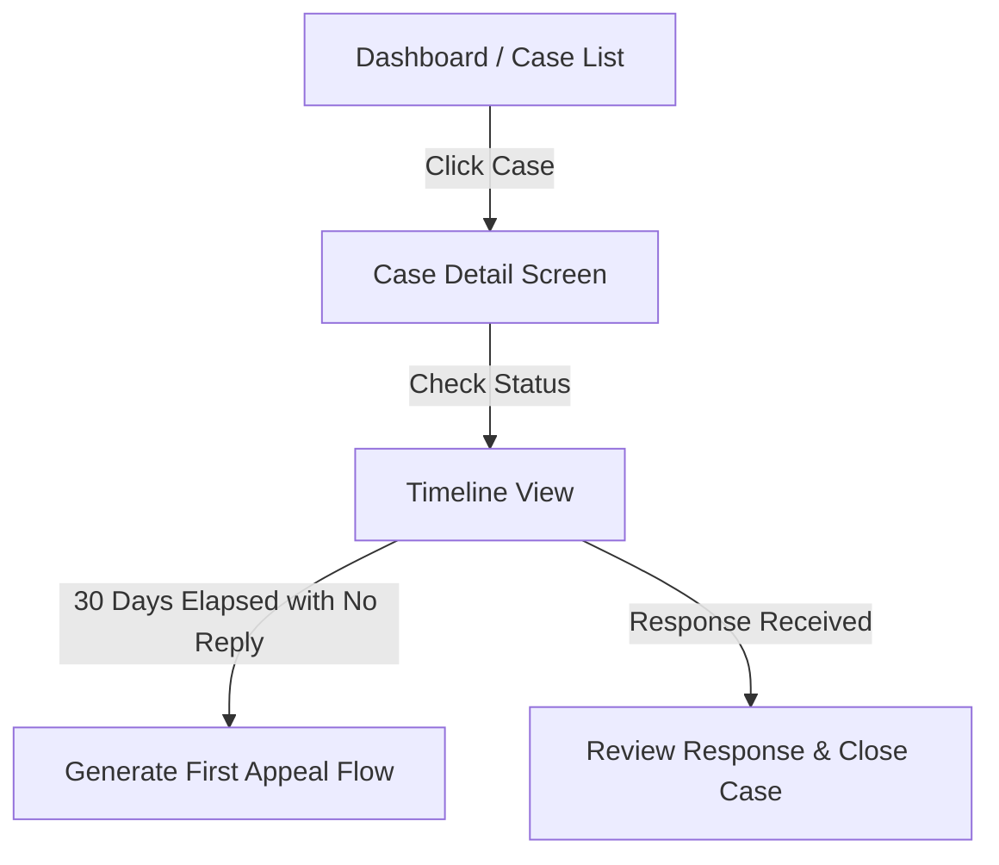
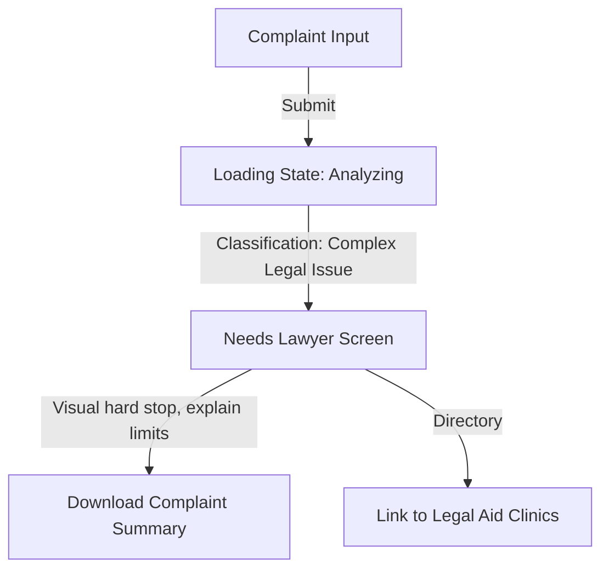

# RightPath Product Design Brief
**Version:** 1.0.0  
**Author:** Senior Product Designer  
**Status:** Approved for Design Phase  

---

## 1. User Flows

RightPath is designed as a calm, trustworthy, and authoritative legal companion for citizens filing Right to Information (RTI) applications. It steers clear of conversational "chatbot" clichés in favor of structured, transparent wizard interfaces.

### Flow A: New User (Ingestion & Filing)

1. **Landing & Complaint Input:** User lands on a clean, editorial layout. They are invited to describe their civic issue in plain language (e.g., *"The municipal road in front of my society has had potholes for 9 months and the local ward office won't answer queries"*).
2. **Analysis / Classification:** The system analyzes the query, runs semantic search against the indexed RTI Act ChromaDB vector store, classifies the issue, maps it to the correct municipal department (e.g., *Works Department / Ward Officer*), and retrieves the relevant legal section (e.g., *Section 6(1) for requests, Section 2(f) for records request*).
3. **Review Classification:** The user sees a structured card showing the detected department and the specific RTI sections that will ground the application.
4. **Review Drafted Application:** The draft is displayed side-by-side with the retrieved statutory sections. The user can edit the facts of the complaint inline.
5. **Filing Confirmation:** Since filing must occur through official online portals (like RTI Online) or physical post, RightPath provides precise, step-by-step guidance on where to send the document and how to pay the fee. The user clicks "Mark as Filed".
6. **Dashboard:** The case is added to the case list, and a 30-day statutory countdown timer is initialized.

---

### Flow B: Returning User (Tracking & Lifecycle)

1. **Dashboard:** The user logs in to see their active cases with clear statutory deadline countdowns (e.g., *"14 days remaining for response"*).
2. **Case Detail & Timeline:** A vertical timeline displays major milestones: *Complaint Drafted -> Filed -> 30-day Deadline Started -> Appeal Window (if breached)*.
3. **Deadline Lapse / Appeal Generation:** If the 30-day statutory response limit passes without response, the timeline nodes alert the user and offer a single CTA: *"Generate First Appeal (under Section 19(1))"*.

---

### Flow C: Edge Flow - Hard Refusal (`needs_lawyer`)

1. **Input Submission:** The user describes a complaint that involves complex criminal matters, ongoing court litigations, or matters strictly exempted under Section 8 of the RTI Act.
2. **Analysis:** The classifier flags this as `needs_lawyer` (low system confidence, or high legal exception risk).
3. **Refusal State:** A highly distinct, respectful, and authoritative "Hard Refusal" state is rendered. To maintain legal safety, the draft generator is locked.
4. **Alternative CTAs:** The user is provided with a generated plain-language summary of why their request falls outside standard RTI jurisdiction, along with contact details for official Legal Aid Clinics and Bar Council Helpdesks.

---

### Flow D: Edge Flow - Statutory Deadline Breach & Appeal
1. **System Alert:** On Day 31 post-filing, if the user hasn't marked the case as "Response Received", the dashboard state flags the case as *"Response Overdue: Section 7(1) Breach"*.
2. **Notification:** An email/dashboard alert informs the user that the Public Information Officer (PIO) has failed to respond within the statutory period, constituting a "deemed refusal" under Section 7(2).
3. **Appeal Draft:** The system automatically drafts the *First Appeal* under Section 19(1), pre-filled with the original request details, PIO details, and the statutory citation for non-response.
4. **Delivery:** The user reviews the drafted appeal, downloads it, and receives guidance on mailing it to the Appellate Authority.

---

## 2. Screen Inventory

| Screen ID | Screen Name | Description / Primary State |
| :--- | :--- | :--- |
| `SCR-001` | **Landing / Landing Input** | Simple header, plain language textarea with guidance prompts, sample prompts, and confidence disclaimer. |
| `SCR-002` | **Loading State (Analyzing)** | Minimalist skeleton screen with active text updating dynamically (e.g., *"Analyzing complaint..."*, *"Identifying jurisdiction..."*, *"Citing RTI Act..."*). |
| `SCR-003` | **Classification Review** | Displays classification results (department, confidence tier, retrieved PIO office, and grounding section citation). |
| `SCR-004` | **Draft Review & Edit** | Split screen: Left panel contains editable drafted application; Right panel contains the official legal text of retrieved sections with highlighted citations. |
| `SCR-005` | **Filing Guide & Confirm** | Step-by-step submission instructions (where to post, fees, upload receipt) and a primary CTA to mark case as "Active/Filed". |
| `SCR-006` | **Dashboard (Case List)** | Grid of active and past cases. Shows statutory timers, current status, and quick filters. |
| `SCR-007` | **Case Detail & Timeline** | Vertical chronological progression of the case. Access to download original draft, track countdown, or file appeal. |
| `SCR-008` | **Hard Refusal (`needs_lawyer`)** | Visually authoritative screen displaying legal exemptions, rationale, and directory of free legal aid agencies. |
| `SCR-009` | **Appeal Draft View** | Review and download screen for Section 19(1) First Appeal documents generated due to deadline breach. |
| `SCR-010` | **System Feedback States** | Reusable templates for Empty states, 404/500 Errors, and Success Toast alerts. |

---

## 3. Screen Layouts & Information Hierarchy

### SCR-001: Landing & Complaint Input
* **Header:** Minimal navbar. RightPath logo (serif, elegant), links to "My Cases", and a simple legal disclaimer button.
* **Primary Content Area:** 
  * **Title:** Slab-serif, centered: *"Describe your civic grievance in plain words. We will draft your official RTI application."*
  * **Input Card:** A central card containing a large text input box (`min-height: 200px`) with a soft background. Placeholder text: *"e.g., My municipal corporation has not repaired the main road in Sector 4 since January..."*
  * **Floating Tips panel (Right / Inline):** Real-time formatting tips: *"Avoid personal opinions; focus on dates, locations, and actions."*
* **Below the Fold:** 
  * Three columns showcasing sample complaints (e.g., *Potholes, Delayed Government Certificates, Missing Public Records*).
  * A clear explanation of what happens next (How RTI works under Section 6).

### SCR-004: Draft Review & Edit
* **Layout:** Two-column split-screen layout (50/50 desktop, stacked mobile).
* **Left Column (The Draft Document):**
  * Mimics a clean, offline sheet of paper (cream background, dark ink typography, mono-spaced headers).
  * Text sections are inline-editable.
  * Formatted headers: *To the Central/State Public Information Officer (PIO)...*
* **Right Column (Statutory Grounding Panel):**
  * Styled as an open legal register.
  * Displays the relevant text of the RTI Act retrieved from ChromaDB (e.g., Section 7, Section 8 exemptions).
  * High-contrast visual links connect sections in the draft to citations in the right-hand panel.
* **Footer Action Bar:** Fixed at the bottom of the screen. Left side shows the confidence tier badge; Right side contains the primary CTA: *"Proceed to Filing Guide"*.

### SCR-008: Hard Refusal Screen (`needs_lawyer`)
* **Layout:** Centered single-column layout, framed in a formal border (editorial styling, not a dashboard widget).
* **Primary Header:** Elegant, bold serif header: *"This request requires formal legal representation."* (Uses deep charcoal text, avoiding cartoonish warning red, but framed with a thick crimson left-border).
* **Detailed Rationale Panel:**
  * Displays the matching legal sections (e.g., Section 8 exemption reasons) that flagged the issue.
  * Clearly states: *"Under Section 8 of the RTI Act, 2005, public authorities are exempt from disclosing information regarding [Exemption Detail]. RightPath cannot draft applications that involve ongoing litigation or restricted records."*
* **Actionable Directory:**
  * Simple, readable list of Local District Legal Services Authorities (DLSA).
  * A secondary button to download a formatted summary of the user's input to take to a lawyer.

---

## 4. Component List

1. **Confidence-Tier Badge (`RightPathConfidenceBadge`):**
   * Displays the classification confidence.
   * Levels: `Settled` (teal), `Jurisdiction Dependent` (amber), `Requires Representation` (red).
   * Design: Thick border, uppercase monospaced text, high contrast.
2. **Timeline Node (`RightPathTimelineNode`):**
   * Shows chronological case milestones.
   * Includes screen-reader labels for active status (e.g., *"Completed: Filed on July 10"*, *"Active: Awaiting Response - 12 days left"*).
3. **Document Panel (`RightPathDocViewer`):**
   * Simulates paper texture. Inline editable blocks.
   * Contains inline highlight tags that match section numbers.
4. **Department Card (`RightPathDeptCard`):**
   * Displays resolved public authority name, PIO office address, and contact details.
5. **Countdown Statutory Widget (`RightPathStatutoryTimer`):**
   * Circular or bar progress showing time elapsed in the 30-day statutory window.
   * Triggers red color and warnings when day 30 is breached.

---

## 5. Design Tokens

### Color Palette

| Token Name | Hex Code | Visual Style / Purpose |
| :--- | :--- | :--- |
| `color-bg-base` | `#FAF8F5` | Base background: Warm off-white, reminiscent of high-quality book paper or parchment. |
| `color-text-primary`| `#111625` | Primary body text: Near-black ink, deep navy hue. High legibility. |
| `color-text-secondary`| `#4F5970` | Muted descriptions, metadata labels. |
| `color-primary` | `#1D2A44` | Editorial brand color: Deep Navy Blue. |
| `color-accent-teal` | `#0E5E53` | "Settled" status / Safe paths / Primary highlights: Forest Green/Deep Teal. |
| `color-accent-amber`| `#C66900` | "Jurisdiction Dependent" warnings / Critical timers: Warm Ochre/Amber. |
| `color-accent-red`  | `#A82216` | "Needs Lawyer" / Breach states: Deep Crimson. |
| `color-border-card` | `#E3DFD5` | Card borders, paper lines. |

### Typography

```text
font-family-headings: "Playfair Display", "Georgia", serif;
font-family-body: "Inter", "system-ui", -apple-system, sans-serif;
font-family-code: "JetBrains Mono", "Courier New", monospace;
```

* **Heading 1:** 40px (Playfair Display, Medium, line-height: 1.2)
* **Heading 2:** 28px (Playfair Display, SemiBold, line-height: 1.3)
* **Heading 3:** 20px (Playfair Display, Regular, line-height: 1.4)
* **Body Text:** 16px (Inter, Regular, line-height: 1.6)
* **Caption / Label:** 12px (Inter, Medium, letter-spacing: 0.05em, uppercase)
* **Code / Citation:** 13px (JetBrains Mono, Regular)

### Spacing Grid
Built on an 8px grid system.
* `$spacing-2xs`: 4px
* `$spacing-xs`: 8px
* `$spacing-sm`: 16px
* `$spacing-md`: 24px
* `$spacing-lg`: 32px
* `$spacing-xl`: 48px
* `$spacing-2xl`: 64px

---

## 6. Component States

### Input TextArea (`RightPathInput`)
* **Empty / Default:** Light cream container with deep gray placeholder text. Border is a solid, subtle `$color-border-card`.
* **Focused:** Thin, elegant border using `$color-primary`, subtle inner shadow. Guidance panel slides in.
* **Loading/Analyzing:** TextArea disabled. Pulsing skeleton text replaces the user input block, representing computational thinking.
* **Error (Validation Failed):** Highlighted with a `$color-accent-red` border. Assistive text below the input field in red: *"Your input appears to contain only random characters. Please describe a civic problem."*

### Hard-Refusal State (`needs_lawyer` Container)
Rather than a standard error banner, this renders as a distinct, formal block:
* **Background:** Solid white sheet inside a thick, double-rule border (`#A82216`).
* **Visual Anchor:** An emblem/icon of a scales logo at the top in dark red.
* **Content Styling:** Strict, high-contrast black text on white. Exemption details are nested inside gray quote blocks citing the specific clause of Section 8.
* **Lock State:** The application draft preview is completely hidden, replaced with a secure lock icon. This ensures no users attempt to generate invalid or legally risky documents.

---

## 7. Accessibility Notes & Inclusive Design

### Color Contrast Ratios
Badges conveying crucial legal status must maintain high contrast to be accessible to visually impaired citizens:
* **Settled Badge:** `#0E5E53` (forest green) on `#E6F4F1` background. Contrast ratio: **6.2:1** (Exceeds WCAG AA & AAA for normal text).
* **Jurisdiction Dependent Badge:** `#8F4A00` (deep amber/ochre) on `#FFF3E0` background. Contrast ratio: **5.1:1** (Exceeds WCAG AA).
* **Needs Lawyer Badge:** `#A82216` (crimson) on `#FDF2F0` background. Contrast ratio: **7.8:1** (Exceeds WCAG AAA).

### Screen Reader Support for the Status Timeline
* Chronological visual timelines are represented as an ordered list (`<ol>`) in the HTML structure.
* Each node uses `aria-current="step"` for the active milestone.
* Screen reader announcements are explicitly configured using visually hidden helper text:
  * `<span class="sr-only">Status: Completed.</span> Filed on July 10, 2026.`
  * `<span class="sr-only">Status: Active Step.</span> Under Review by PIO. 12 days remaining.`

### Keyboard Navigation
* The case dashboard can be completely traversed using the `Tab` key.
* Focus outlines are visible, using a high-contrast dotted border around active dashboard cards.
* Interactive cards can be opened using the `Enter` or `Space` key.
* In split-screen view (`SCR-004`), keyboard users can jump directly between citation links and the referenced statutory clauses using `aria-describedby` links.

### Plain Language & Low-Literacy Support
* **Jargon Mitigation:** Avoid complex procedural terminology in the UI:
  * Instead of: *"Enter the public authority's primary PIO details under Section 5(1)"*
  * Use: *"Enter the office address of the officer who handles information requests for this department."*
* **Static Guidance:** Provide clear hover tooltips and inline explanations for legal terms (e.g., hover tooltip on *"First Appeal"* explains: *"A request to a higher officer if the first officer does not answer on time."*).
